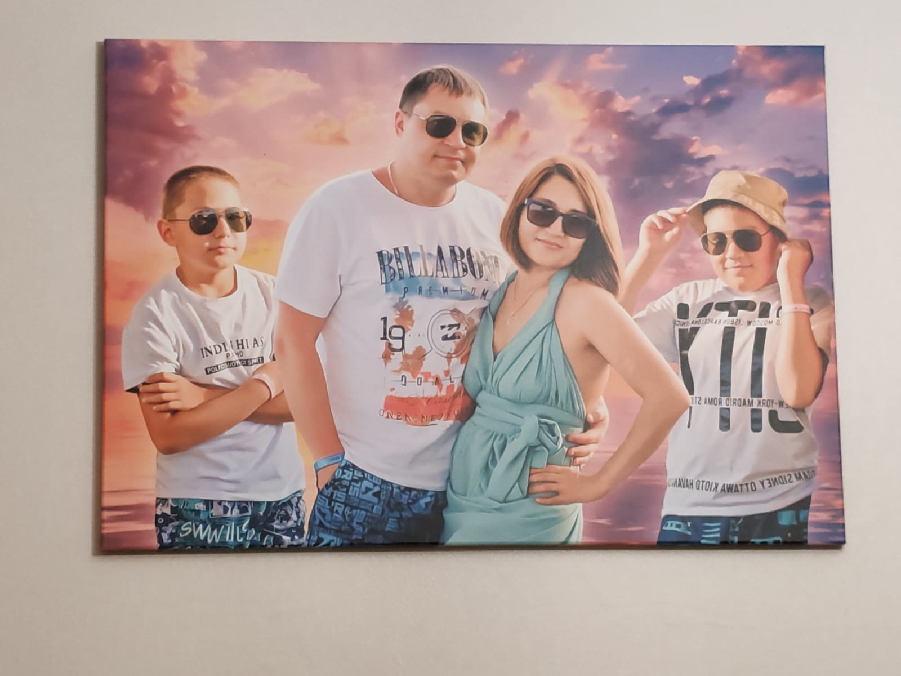

# Портфолио
## Осипова Регина Азатовна
### О себе
Родилась яркой и красивой. Мать двоих детей

### Образование
Имею среднее специальное техническое образование и высшее экономическое.

### Почему учусь
Решила получить образование, для подработки в свободное от основной работы (мать, жена и домохозяйка) время.
Надеюсь получить новые знания, навыки, а также познакомиться с интересными людьми.

### Хобби
* Чтение
* Музыка
* Посещение природных памятников
* Отдых с семьей
* Просмотр сериалов и аниме

### Планы на будущее
Третий ребенок, возможность устроится удаленно и совмещать материнство с работой, чтобы не потерять приобретенные навыки

### Фотография
